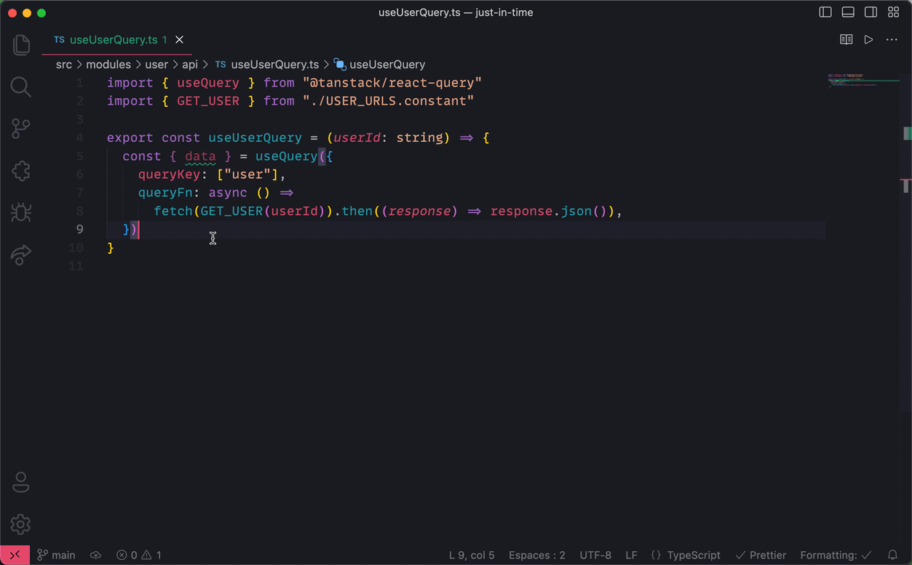

# Doc-JIT

 *Just In Time* documentation.

## Introduction

Display the right documentation when you need it. `Doc-JIT` is an VS Code extension developers to open the most relevant documentation when coding features.

## Getting started

There are 2 ways to use just in time documentation:

### The configuration file

*This is the recommended way if you already have a documentation.*

`Doc-JIT` uses [cosmiconfig](https://github.com/davidtheclark/cosmiconfig) for configuration file support. You can either configure with:

1. A `"doc-jit"` key in your package.json file.
1. A `.doc-jitrc` file written in JSON or YAML.
1. A `.doc-jitrc.json`, `.doc-jitrc.yml`, `.doc-jitrc.yaml`, or `.doc-jitrc.json5` file.
1. A `.doc-jitrc.js`, `.doc-jitrc.cjs`, doc-jit.config.js, or doc-jit.config.cjs file that exports an object using module.exports.
1. A `.doc-jitrc.toml` file.

The configuration file will be resolved starting from the location of the file being formatted, and searching up the file tree until a config file is (or isn’t) found.

Example:

```json
{
  "patterns": {
    "**/modules/**/api/**/*.hook.ts": "https://link-to-fetching-api-documentation.io",
    "**/shared/utils/**": [
      "https://link-to-shared-module-documentation.io",
      "https://link-to-util-documentation.io"
    ]
  }
}
```

### The documentation `.doc-jit` directory

If you want to have the documentation close to the code, you can in a `doc-jit` directory and following these steps:

1. Create a `.doc-jit` directory next to `src`,
2. write your documentation based on your architecture,
3. use wildcards `__` when folders have specific names (eg: `modules/__/components/component.md` works for `modules/user/component/` or `modules/book/component/`)



___

## References

[Icon created by Hilmy Abiyyu A. - Flaticon](https://www.flaticon.com/free-icons/exam)
